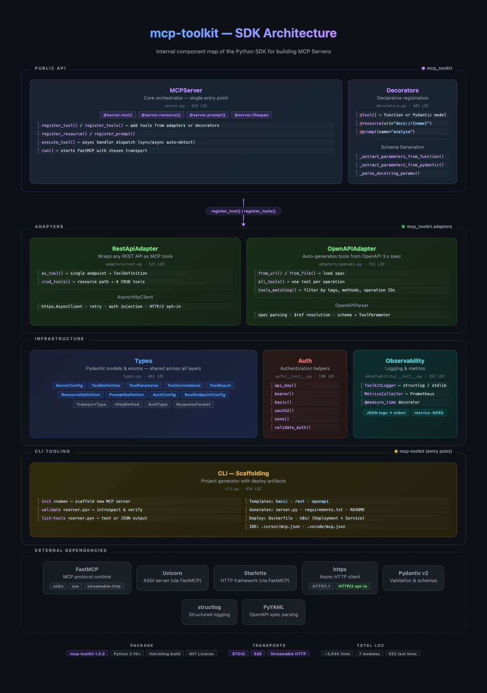

# MCP Toolkit

Python SDK for simplified creation of MCP Servers (Model Context Protocol).

<p align="center">
  
</p>

## Overview

MCP Toolkit lets developers build MCP Servers declaratively and pythonically, with first-class support for exposing existing REST APIs as MCP tools.

### Key Features

- **Decorator-first**: Pythonic API using `@tool`, `@resource`, `@prompt`
- **REST-first**: Built-in adapters to consume REST APIs and expose them as tools
- **OpenAPI Import**: Automatic tool generation from OpenAPI specs
- **Type-safe**: Extensive use of Pydantic for validation and schema generation
- **Observable**: Structured logging and optional Prometheus metrics

## Installation

```bash
pip install mcp-toolkit
```

For optional features:

```bash
# OpenAPI support
pip install mcp-toolkit[openapi]

# Prometheus metrics
pip install mcp-toolkit[metrics]

# Everything included
pip install mcp-toolkit[all]
```

## Quick Start

### Example 1: Basic Server

```python
from mcp_toolkit import MCPServer

server = MCPServer("my_mcp")

@server.tool()
def calculate_shipping(origin_zip: str, destination_zip: str, weight_kg: float) -> dict:
    """Calculates shipping cost between two zip codes."""
    return {"cost": 45.90, "delivery_days": 3}

if __name__ == "__main__":
    server.run()
```

### Example 2: Exposing a REST API

```python
from mcp_toolkit import MCPServer
from mcp_toolkit.adapters import RestApiAdapter
from mcp_toolkit.auth import bearer

server = MCPServer("sales_mcp")

api = RestApiAdapter(
    base_url="https://api.company.com/v1",
    auth=bearer("API_TOKEN"),  # Reads from env var API_TOKEN
)

# Map endpoint → tool
server.register_tool(
    api.as_tool(
        method="GET",
        path="/customers/{customer_id}",
        name="get_customer",
        description="Fetches customer data by ID",
    )
)

# Generate full CRUD
server.register_tools(
    api.crud_tools(
        resource_name="order",
        resource_path="/orders",
    )
)

server.run()
```

### Example 3: Importing from OpenAPI

```python
from mcp_toolkit import MCPServer
from mcp_toolkit.adapters import OpenAPIAdapter

server = MCPServer("crm_mcp")

adapter = OpenAPIAdapter.from_url(
    "https://api.crm.company.com/openapi.json",
    auth_header="X-API-Key",
    # optional base_url: use if the spec has no "servers" or to override it
    # base_url="http://localhost:8000",
)

# Register all operations
server.register_tools(adapter.all_tools())

# Or filter by tags
server.register_tools(
    adapter.tools_matching(tags=["customers", "opportunities"])
)

server.run()
```

## Documentation

### MCPServer

Main class for creating MCP Servers.

```python
from mcp_toolkit import MCPServer, ServerConfig, TransportType

# Simple form
server = MCPServer("my_mcp")

# With detailed configuration
config = ServerConfig(
    name="my_mcp",
    version="1.0.0",
    transport=TransportType.STREAMABLE_HTTP,
    port=9000,
    log_level="DEBUG",
)
server = MCPServer(config)
```

#### Transports (stdio, SSE, Streamable HTTP)

The SDK supports three transport types via `TransportType` and `server.run()`:

| Transport | Usage | When to use |
|-----------|-------|-------------|
| **STDIO** (default) | `server.run()` or `transport=TransportType.STDIO` | Client (e.g. Cursor) starts the process and communicates via stdin/stdout. Ideal for local use. |
| **SSE** | `server.run(transport=TransportType.SSE, host="127.0.0.1", port=9000)` | HTTP server with Server-Sent Events. Endpoints: `/sse`, `/messages/`. |
| **Streamable HTTP** | `server.run(transport=TransportType.STREAMABLE_HTTP, port=9000)` | Modern HTTP server, single endpoint (e.g. `/mcp`). Recommended for network/cloud deployments. |

For HTTP transports (SSE or Streamable), `host` and `port` come from `ServerConfig` or can be passed via `run(host=..., port=...)`.

### Decorators

#### @tool

Registers a function as an MCP tool.

```python
from pydantic import BaseModel, Field

# Simple form
@server.tool()
def my_tool(param: str) -> str:
    """Tool description."""
    return f"Result: {param}"

# With Pydantic model
class InputModel(BaseModel):
    name: str = Field(..., description="User name")
    age: int = Field(..., ge=0, le=150, description="Age")

@server.tool()
def create_user(params: InputModel) -> dict:
    """Creates a new user."""
    return {"name": params.name, "age": params.age}

# With annotations
@server.tool(
    name="fetch_data",
    annotations={"readOnlyHint": True, "idempotentHint": True}
)
def fetch(id: str) -> dict:
    """Fetches data by ID."""
    return {"id": id}
```

#### @resource

Registers a resource accessible by URI.

```python
@server.resource(uri="docs://{name}")
def get_document(name: str) -> str:
    """Returns document content."""
    return Path(f"docs/{name}.md").read_text()

@server.resource(uri="config://{key}", mime_type="application/json")
def get_config(key: str) -> str:
    """Returns configuration."""
    return json.dumps(configs.get(key))
```

#### @prompt

Registers a prompt template.

```python
@server.prompt(name="customer-analysis")
def analysis_prompt(customer_id: str) -> str:
    """Prompt for customer analysis."""
    return f"""
    Analyze customer {customer_id} considering:
    1. Purchase history
    2. Support tickets
    3. Upsell potential
    """
```

### REST Adapter

Converts REST endpoints into MCP tools.

```python
from mcp_toolkit.adapters import RestApiAdapter
from mcp_toolkit import ToolParameter

api = RestApiAdapter(
    base_url="https://api.example.com",
    auth=bearer("TOKEN"),
    timeout=30.0,
    max_retries=3,
)

# Specific endpoint
tool = api.as_tool(
    method="GET",
    path="/users/{id}",
    name="get_user",
    description="Fetches user by ID",
    query_params=[
        ToolParameter(
            name="fields",
            type="string",
            description="Fields to return",
            required=False,
        )
    ],
)

# Full CRUD
tools = api.crud_tools(
    resource_name="product",
    resource_path="/products",
    create_params=[
        ToolParameter(name="name", type="string", description="Name", required=True),
        ToolParameter(name="price", type="number", description="Price", required=True),
    ],
)
```

### OpenAPI Adapter

Automatically imports OpenAPI specs.

- **Base URL**: The spec should have `servers: [{"url": "https://..."}]` with a full URL. If missing, the adapter derives it from the spec URL (e.g. `http://localhost:8000/openapi.json` → `http://localhost:8000`) or you can pass `base_url` in `from_url()`.

```python
from mcp_toolkit.adapters import OpenAPIAdapter

# From URL (base_url derived from spec URL if spec has no "servers")
adapter = OpenAPIAdapter.from_url("https://api.com/openapi.json")

# With explicit base_url (useful when spec doesn't define servers)
adapter = OpenAPIAdapter.from_url(
    "http://localhost:8000/openapi.json",
    base_url="http://localhost:8000",
)

# From file (base_url required)
adapter = OpenAPIAdapter.from_file("./openapi.yaml", base_url="https://api.com")

# List available operations
print(adapter.list_available_tags())
print(adapter.list_available_operations())

# Filter tools
tools = adapter.tools_matching(
    tags=["users"],
    methods=["GET", "POST"],
    path_pattern=r"/api/v2/.*"
)
```

### Authentication

Helpers for configuring authentication.

```python
from mcp_toolkit.auth import api_key, bearer, basic, oauth2

# API Key
auth = api_key("X-API-Key", env_var="MY_API_KEY")

# Bearer token
auth = bearer("MY_TOKEN")

# Basic auth
auth = basic("USERNAME_VAR", "PASSWORD_VAR")

# OAuth2
auth = oauth2(
    client_id_env="CLIENT_ID",
    client_secret_env="CLIENT_SECRET",
    token_url="https://auth.com/oauth/token",
    scopes=["read", "write"],
)
```

### Observability

Structured logging and metrics.

```python
from mcp_toolkit.observability import ToolkitLogger, MetricsCollector

# Logging
logger = ToolkitLogger("my_mcp", level="DEBUG", structured=True)
logger.info("Message", extra_field="value")

# Metrics (requires prometheus-client)
metrics = MetricsCollector(prefix="my_mcp")
metrics.start_server(port=9090)

with metrics.measure_tool("my_tool"):
    # tool execution
    pass
```

## CLI

The toolkit includes a CLI for scaffolding.

```bash
# Create new project
mcp-toolkit init my_server

# With REST template
mcp-toolkit init my_server --template rest --base-url https://api.com

# REST without authentication (local APIs)
mcp-toolkit init my_server --template rest --base-url http://localhost:8000 --no-auth

# With OpenAPI template (--base-url optional; --no-auth for unauthenticated APIs)
mcp-toolkit init my_server --template openapi --openapi-url http://localhost:8000/openapi.json --base-url http://localhost:8000
mcp-toolkit init my_server_mcp --template openapi --openapi-url http://localhost:8000/openapi.json --base-url http://localhost:8000 --no-auth

# Validate server
mcp-toolkit validate server.py

# List tools
mcp-toolkit list-tools server.py --format json
```

## Recommended Project Structure

```
my_mcp/
├── server.py           # Main server
├── tools/              # Custom tools
│   ├── __init__.py
│   ├── sales.py
│   └── inventory.py
├── resources/          # Resources
│   └── docs/
├── config.py           # Configuration
├── requirements.txt
└── README.md
```

## Testing

```bash
# Install dev dependencies
pip install mcp-toolkit[dev]

# Run tests
pytest

# With coverage
pytest --cov=mcp_toolkit
```

## Contributing

1. Fork the repository
2. Create your branch (`git checkout -b feature/new-feature`)
3. Commit your changes (`git commit -m 'Add new feature'`)
4. Push to the branch (`git push origin feature/new-feature`)
5. Open a Pull Request

## License

MIT License — see [LICENSE](LICENSE) for details.

## Links

- [MCP Protocol Specification](https://modelcontextprotocol.io/)
- [MCP Python SDK](https://github.com/modelcontextprotocol/python-sdk)
- [Anthropic Documentation](https://docs.anthropic.com/)
